# Fan Art
## Links
[The deployed site](https://fan-art.herokuapp.com/)  
[The deployed API](https://fan-art-drf-api.herokuapp.com/)  
[The API repository](https://github.com/AnnieNeilson/fan-art-drf-api)  
[My Github Project](https://github.com/users/AnnieNeilson/projects/4)

## Contents
- [Site Goals](#site-goals)
- [Description](#description)
- [Planning](#planning)
- [Wireframes](#wireframes)
- [User Stories](#user-stories)
- [Features](#features)
- [Components](#components)
- [Technologies Used](#technologies-used)
- [Testing](#testing)
- [Deployment](#deployment)
- [Credits](#credits)

Fan Art is a content sharing website for people who like to create artwork based on their favourite things.

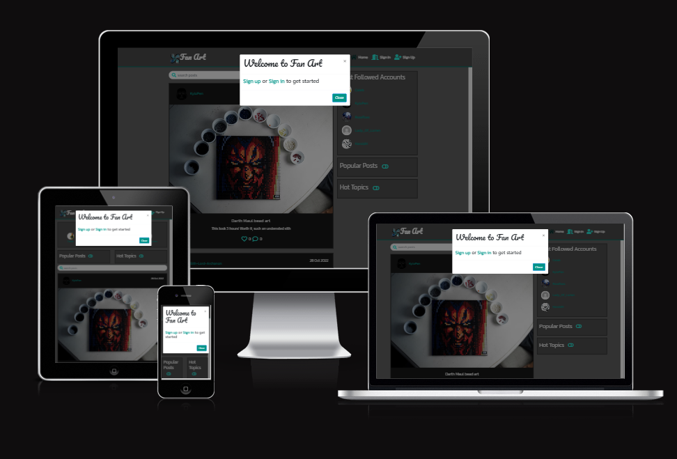

## Site Goals

The goal of this site is to provide an online space for sharing content, finding inspiration and creating connections with other artists. The site is geared towards topics typically described as "nerdy" but all art is welcome.  
Fan Art achieves this by:
* Giving signed up users the ability to post
* Giving all users the ability to peruse the site by searching for posts or accounts that fit their interests
* Giving all users the ability to find users via the Top Accounts, Popular Posts and Hot Topic features

## Description

Fan Art gives users the opportunity to share their artwork with fellow artists.
Once a user has signed in they have access to all the features of the site:

- Creating, editing and deleting posts
- Liking and commenting on posts
- Creating, editing and deleting comments
- Following other users
- Gaining followers when other users follow them
- View a feed of content from profiles they have explicitly chosen to follow
- View content that they have liked in the past

### Planning

I created this Entity relationship diagram to help visualise the backend of this project

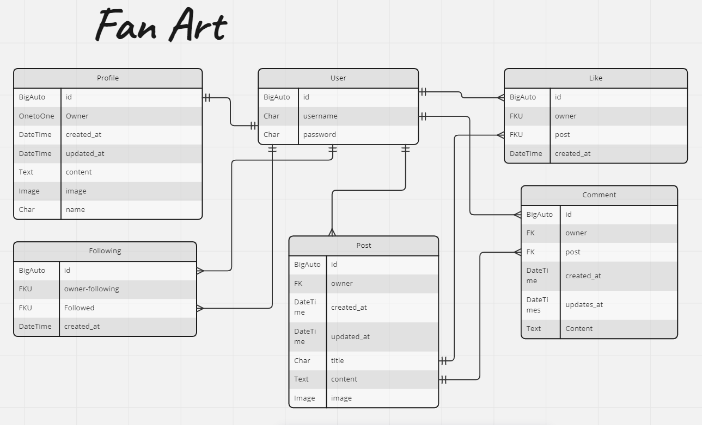

## Wireframes 

created with Balsamiq. The project was inspired by the Code Institute Moments project and developed from these initial wireframes

Click to see wireframes:

[HomePage - Signed out](./images/planning/home-signed%20out.PNG)  
[HomePage - Signed in](./images/planning/home-signed%20in.PNG)  
[Sign Up](./images/planning/Sign%20Up.PNG)  
[Sign In](./images/planning/Sign%20In.PNG)  
[Post](./images/planning/Postpage.PNG)  
[Create Post](./images/planning/New%20Post%20Page.PNG)  
[Feed](./images/planning/Feed.PNG)  
[Liked Posts](./images/planning/Liked%20Posts.PNG)  
[Profile Page](./images/planning/ProfilePage.PNG)  

## User Stories

The user stories for this project can be found in the git Issues tab [here](https://github.com/AnnieNeilson/fan-art/issues)

To view the project board for this site, please [Click Here](https://github.com/users/AnnieNeilson/projects/4)

### Features
Features planned
* Responsive design.
* Navigation Menu (Site Wide).
* CRUD Functionality
* Sign in functionality.
* Sign out functionality.
* Ability to view all posts
* Ability to view post details.
* Ability to create, update and delete posts, comments, likes.
* Ability to follow/unfollow other users
* Ability to edit profile username, password, profile image, profile bio

#### Home Page

Upon arriving at the site the user, who is not signed in will be greeted by a modal encouraging them to sign in or up. This can be closed by clicking the close button, the cross button in the top-right corner, by clicking anywhere outside the modal or by choosing to follow the links and either sign in or up. The user can then continue to the site without necessarily signing in. I did this because I find it discouraging when a site requires you to create an account just to view content. I think it is very off-putting to require a potential user to sign in before they have a chance to decide if the site is even what they are looking for.
The home page, like all the pages of this site, has a responsive navigation bar. The brand name is placed on the far left, with the rest of the links to the right.
Initially, the unregistered user can only see links to the homepage, to sign in and to sign up:

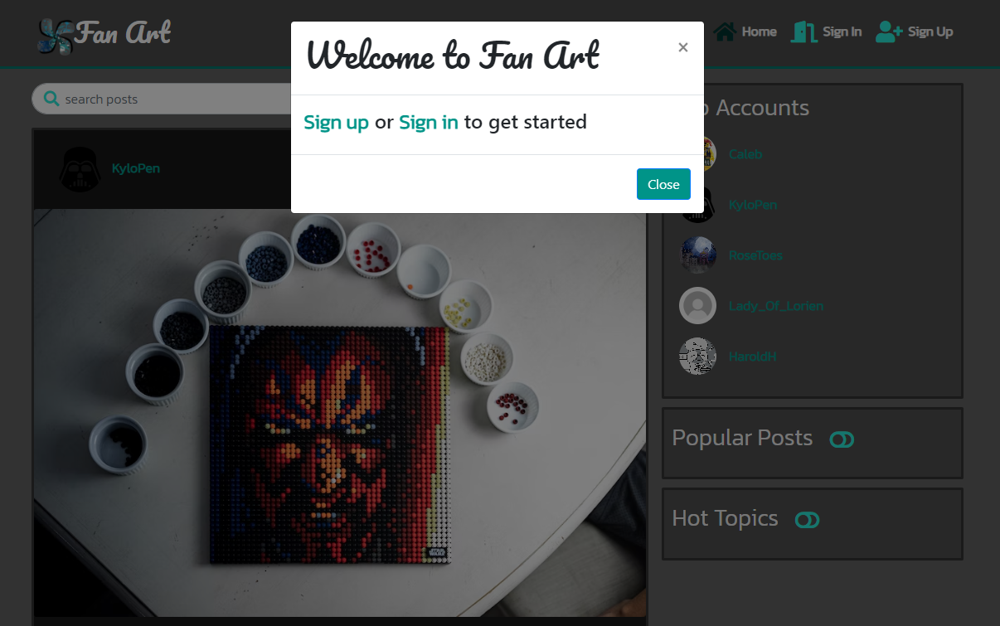  
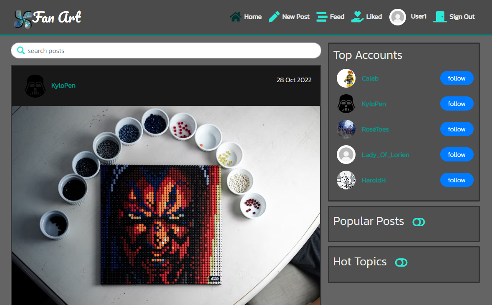  

Once signed in the user can see links to; Home, New Post, Feed, Liked, Profile Page (displays the username) and Sign Out
The user, signed in or out, can view the home page which displays the most recent posts. The homepage has an infinite scroll feature for the users ease. The user can view on posts either in the homepage or in the posts individual page by clicking on the post. The user cannot like or comment without being logged in.  

On the home page to the right, (unless in mobile) is a section that display the Top Accounts of the site. This section shows the five accounts that have the highest follower count. Directly below this section is the Popular Posts section followed by the Hot Topics section. These sections work in a very similar manner, showing the most liked and most commented on posts.  

All users can view the profiles of users, but they cannot follow any accounts if they are not signed in.
Immediately below the navbar is a search bar. This can be used to search for posts; results are filtered by title and creator. Beneath this the posts from site users are displayed. They are displayed showing the most recent at the top. I decided on this ordering so the users are seeing the most up to date content and so they will likely see new content every time they go to the home page.
To the right, (unless in mobile) is a section that displays the top profiles of the site. This section shows the four accounts that have the highest follower count. Directly below this section is the Popular Posts section followed by the Hot Topics section. These sections work in a very similar manner, showing the most liked and most commented on posts.
The aim of these sections is to encourage the user to engage with content immediately whether signed in or not, this shows the user just how much is going on at Fan Art.

#### Sign Up

The Sign Up page is very simple, offering a prompt to the user to sign in (with a link to the sign up page) if they already have an account.
Then a basic form, requesting:
*Username
*Password
*Confirm Password - both password fields must match
Followed by a Sign Up button in the standard styles.
If any of the form data is not valid the button will not submit, the page will show relevant error messages with suggestions on how to fix the issues.
On submitting the form the user will be taken to the sign in page, so they can sign in immediately and begin enjoying the site.  

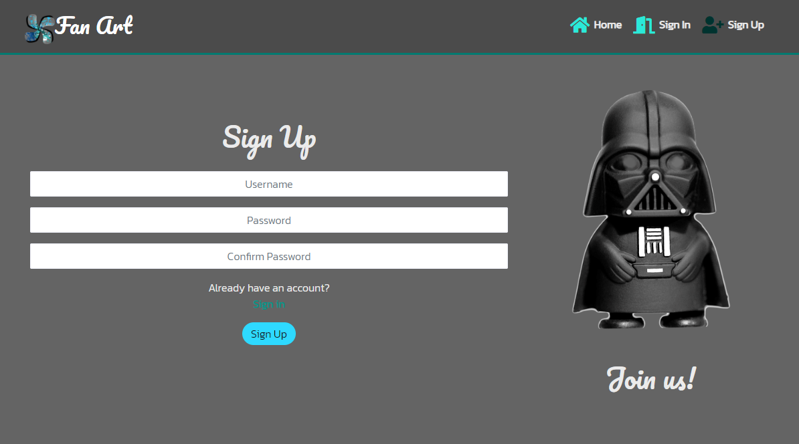  

#### Sign In Page

The Sign In page is very simple, offering a prompt to the user to sign up (with a link to the sign up page) if they do not already have an account.
Then a basic form, requesting:
*Username
*Password
Followed by a Sign In button in the standard styles.
If any of the form data is not valid the button will not submit, the page will show relevant error messages with suggestions on how to fix the issues.
On submitting the form the user is taken back to the page they were previously at, unless they’ve come from the sign in page, in that case they will be directed to the home page.

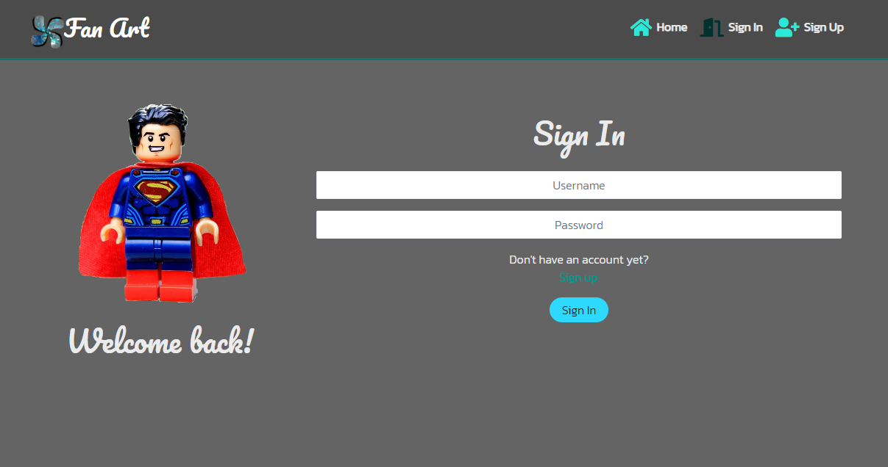

#### Top Accounts

This section of the site is present on the home, posts, feed, liked and profile page
It displays the top 5 (3 on mobile) accounts, the accounts with the highest number of followers.
It shows each users profile image and user. To the far right is a follow button, which will only be present if the profile listed is not the current user’s or followed by the current user.

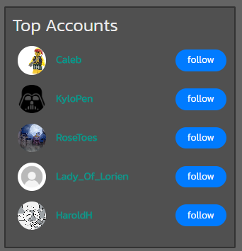

#### Popular Posts/ Hot Topics

This section of the site is present on the home, posts, feed, liked and profile page
The Popular Posts section displays the 3 posts with the most likes. The Hot Topic section displays the 3 posts with the most comments.
Both the sections have an accordion toggle. When the page loads the sections are closed, I decided to do this so that user could see the available options and choose what to see. It makes the overall page look cleaner and more organised. It is also helpful as on a mobile display the sections appear above the feed of posts and would look very messy if they were open on load.

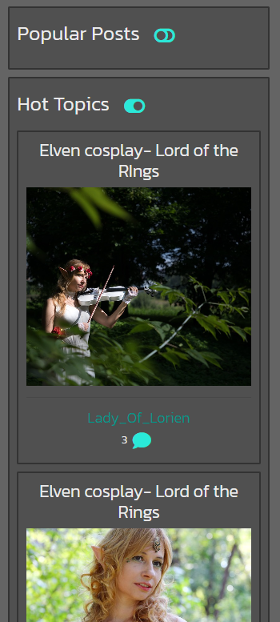

#### New Post
This page is from creating a new post. Only signed in users can access this page. It includes a form with an option to upload an image.
If any of the form data is invalid the form will not submit, the page will show relevant error messages with suggestions on how to fix the issues.

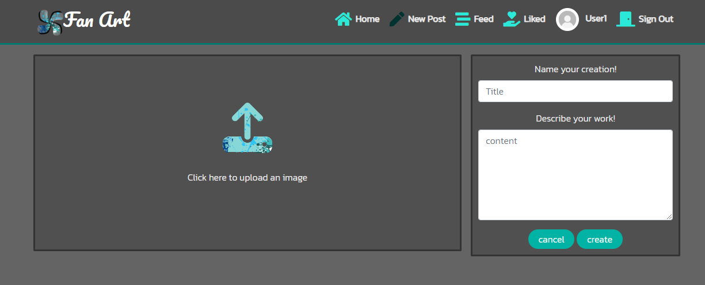

#### Post page
Clicking on any post image will navigate the user to the Post’s page. On this page the user will find this post alone displayed, with relevant information including:
* post owner
* the date the post was created
* the image
* post title
* post description
* likes count, which indicates whether the current user has liked it; if liked the icon will appear solid and red.
* comments count
* comments form
* comments or a paragraph where the comments will be, encouraging the current user to comment.  

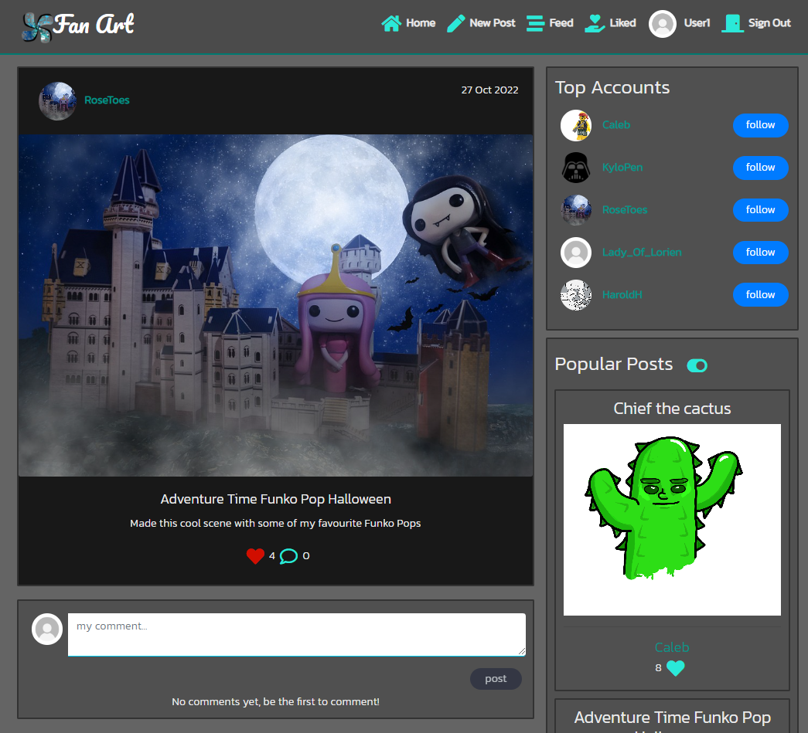

Each post, belonging to the current user, displays a dropdown menu giving the user the option to edit or delete their post. 

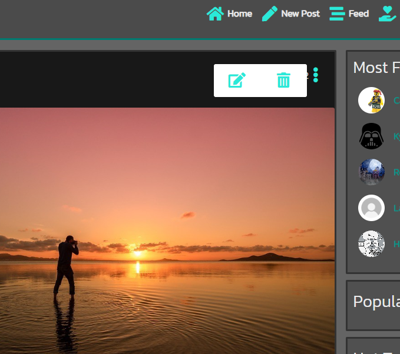

#### Comments
Underneath the post in the Post page is the comments section. If there are no comments a paragraph is displayed encouraging the user to comment. Comments are displayed with the most recent comment showing first. Each comment displays the owners profile image, username, comment and a timestamp showing how long ago the comment was made. Each comment that is owned by the current user display a dropdown menu icon that gives the user the ability to edit or delete their comment. Changes are implemented immediately without refreshing the page.  

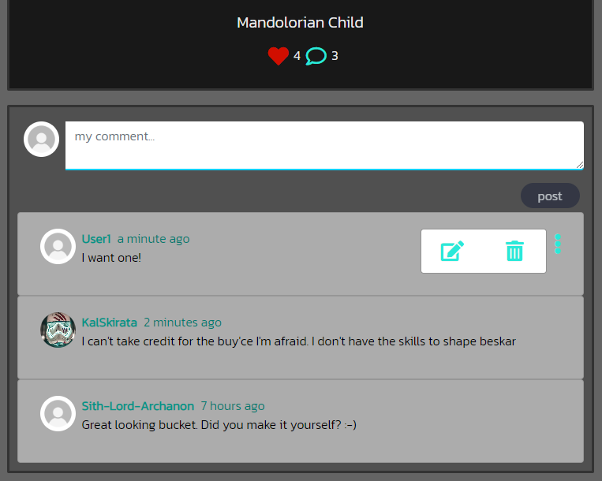

#### Feed/Liked pages
The feed and liked pages are very similar to the home page. They have the same layout and function the same way. The only difference being the content displayed. The Feed displays all the content from users that the current users follows. The Liked page displays all the content that the current user has liked.
If the current user is not following anyone or has not liked any posts a no results image will appear and advise the user to try a new search, follow a user or like a post.

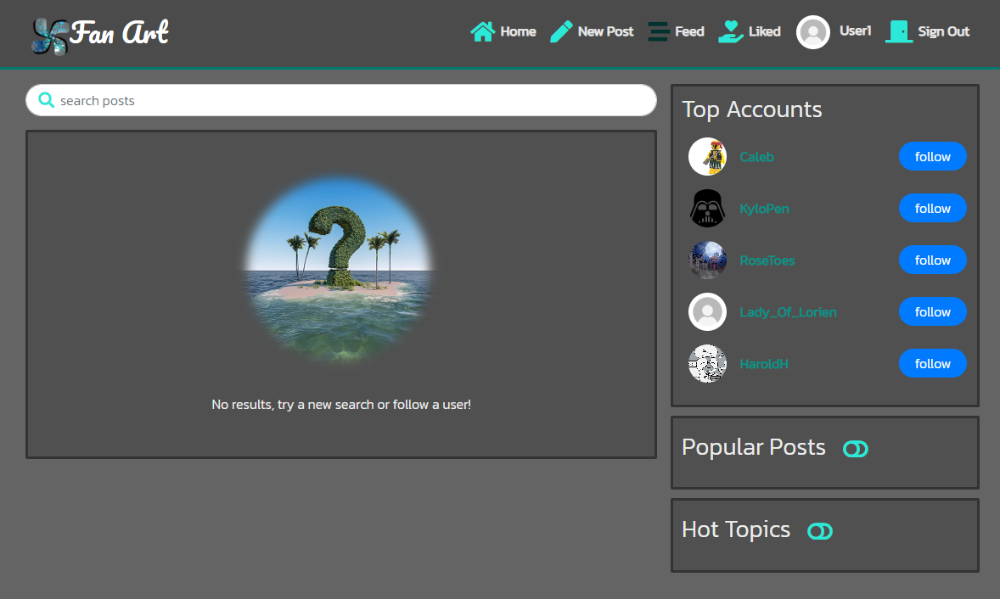  
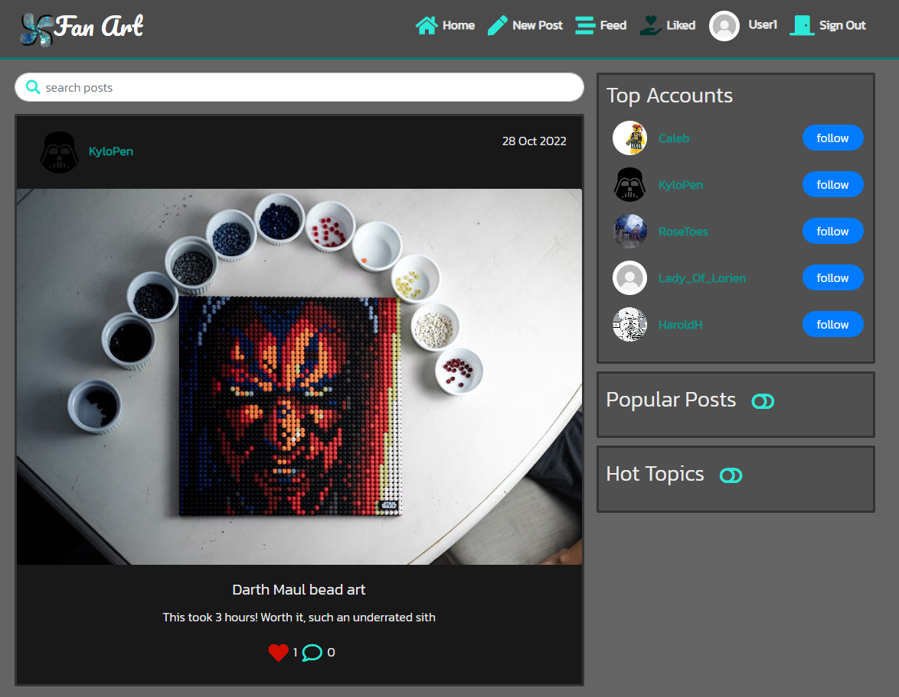

### Future Features
I would like to give the users the ability to:
* Reply to other users comments
* Filter posts by a variety of categories
* search post for specific terms
* create their own tags

## Components

Several components were setup throughout the project and reused through-out: 
* [MoreDropdown.js](https://github.com/AnnieNeilson/fan-art/blob/main/src/components/MoreDropdown.js)
added a dropdown menu for posts and comments to allow users to edit and delete their own content. Also added a dropdown menu for profiles, so user's can edit their profile or account details.
* AxiosDefault.js
helped with communication with the backend API
* [NavBar.js](https://github.com/AnnieNeilson/fan-art/blob/main/src/components/NavBar.js) added a navigation bar to the site, it responds to user logged in status to show the appropriate links.
* [Asset.js](https://github.com/AnnieNeilson/fan-art/blob/main/src/components/Assets.js) was used for the loading spinner throughout the site.
* [Avatar.js](https://github.com/AnnieNeilson/fan-art/blob/main/src/components/Assets.js) was used for the user's avatar throughout the site.
* [PageNotFound.js](https://github.com/AnnieNeilson/fan-art/blob/main/src/components/PageNotFound.js) provides a Page Not Found page, for any errors or if there are no search results.
* [CurrentUserContext.js](https://github.com/AnnieNeilson/fan-art/blob/main/src/contexts/CurrentUserContexts.js) confirms the user's logged in status to determine what functionality is available to that user.
* [ProfileDataContext.js](https://github.com/AnnieNeilson/fan-art/blob/main/src/contexts/ProfileDataContext.js) is used for providing data for a user's profile and for following and unfollowing users. 
* [useRedirect.js](https://github.com/AnnieNeilson/fan-art/blob/main/src/hooks/useRedirect.js)
redirects a user to a page based on whether they are signed in or out.
* [utils.js](https://github.com/AnnieNeilson/fan-art/blob/main/src/utils/utils.js)
supplies functionality to all of the components that utilise the Infinite Scroll.

## Technologies Used
* HTML, JavaScript & CSS  
--  This project uses custom written CSS to style the Website and features custom JSX code
* Python  
-- This project was created using the Django Rest framework, the back-end logic and the means to run/view the Website.
* React/Bootstrap  
-- The React Bootstrap framework was used through the website for layout and responsiveness.  
* Google Fonts
-- used in the project to import the fonts for the site.
* GitHub
--  the hosting site used to store the source code for the Website.
* Gitpod
-- as version control software to commit and push code to the GitHub repository where the source code is stored.
* Cloudinary
-- storage for the deployed sites static and Media files.
* Heroku
-- Heroku was used to deploy the live website.
* Google Chrome Developer Tools
-- Google chromes built in developer tools are used to inspect page elements and help debug issues with the site layout and test different CSS styles.
* Balsamiq Wireframes
-- This was used to create wireframes for 'The Skeleton Plane' stage of UX design.
* Miro 
-- This was used to create the Entity relationship diagram
* Font Awesome
-- All the Icons displayed throughout the website are Font Awesome icons
* Am I Responsive
-- Multi Device Website Mockup Generator was used to create the Mock up image in this README

## Testing

### Manual Testing

The website was extensively tested as it was developed using:  
* Console.log
* Testing scenarios manually.
* Testing functionallity manually.
* Testing User Stories.

#### Testing User Stories

1. Navigation: As a user I can clearly see and easily use a navigation bar on every page so that I can easily navigate between pages
* I visited every page ensuring that the navigation bar was clearly visible, that all links worked effectively and that the corrent links were showned based on the user's signed in status

2. Routing: As a user I can navigate through pages without reloading so that I can move between pages with ease
* I visited every page ensuring that I could change between pages without a page refresh and that the links all functioned correctly

3. Authentication - Sign Up: As a new user I can create a new account so that I can access all the features of the site
* I confirmed that the sign up link was clear and easily found in the navigation bar. I entered invalid data to ensure that appropriate warnings appeared. When entering valid information the sign up was successful and I was brought to the sign in page without errors

4. Authentication - Sign in: As a user I can sign in so that I can access my account and the functionality that signed in users can access
* I entered invalid data to ensure that appropriate warnings appeared. When entering valid information the sign in was successful.

5. Authentication - Logged In Status: As a signed in user I can tell that I am logged in so that I can see whether I need to sign in/out
* While I was signed out the navigation bar showed the links to sign in or sign up, I signed in and confirmed the navigation bar display the sign out link. My profile name was also clearly displayed, and when I clicked on it, I was taken to my profile.

6. Authentication - Refreshing access tokens: As a signed in user I can remained logged in until I choose to log out so that my user experience is not interrupted and frustrating
* I signed in to my account, after refreshing the page I was still signed in.

7. Avatar: As a signed in user I can view other user's avatars so that I can identify other users
* By visiting the homepage, I confirmed that other user's avatars are visible on their posts and in the top accounts list. By visiting multiple users' profiles I confirmed that their avatars can be seen on their profile.

8. Create Posts: As a signed in user I can create posts so that I can share my artwork on the platform
* I signed in and followed the 'New Post' link. I successfully uploaded an image from my computer, added a title and caption and clicked create. The post was successfully created and I was brought to the post's page. I repeated the process, but I instead clicked cancel and I was redirected to the home page.

9. View a Post: As a user I can view a single post so that I can see the details of the post
* On the homepage I can view the title, image and details of a post, whether signed in or out. I clicked on several posts and each one I was successfully taken to the post's page where I could see all the details of the post including the OP's name and avatar

10. Like a Post: As a user I can like a post so that I can show my support for the posts I like
* While signed out, I attempted to like a post the appropriate warning appeared telling me to sign in to like posts. I signed in and could successfully like any post. Once clicked the icon turns red to confirm I have liked the post. I clicked again to confirm that I could unlike a post.

11. View recent posts: As a user I can view posts ordered by most recently created so that I can stay updated and see new content as it is posted
* I checked that the posts on the homepage, profile pages, liked posts and newsfeed were ordered by date, most recent showing first. This was so.

12. Post Search: As a user I can search for posts with keywords so that I can easily find things I am interested in
* Using the search bar I typed in text I knew was included in a post descripton, only posts containing the search term appeared. I also typed in text I knew was not in any post description or title. No posts were returned, instead a message saying "No results, try a new search?" was shown

13. View Liked Posts: As a signed in user I can view the posts that I have liked so that I can revisit content that I have enjoyed in the past
* I signed in, liked a couple of posts, then navigated to the Liked page. Only the posts I had liked appeared. I unliked one of the posts and refreshed the page. That post was no longer there.

14. View Posts of followed users: As a signed in user I can filter the posts I see to just see posts of users I follow so that I can choose to see content I have specifically selected
* I signed in and navigated to the Newsfeed, there were no posts to show. I followed an account, then back in the newsfeed page only posts of the account I had followed appeared. 

15. The Post Page - View My Post: As a signed in user I can view my post's page so that I can see the details of my post, the comments and likes that have been left by other users
* Whilst signed in I visited my profile and clicked on the post I had previously created. I was able to see all the details of my post including: title, image, description, comments count, likes count and comments.

16. The Post Page - Edit Post: As a signed in user I can edit my post so that I can make corrections or updates to my post after posting it
* Whilst signed in and on my own profile page I clicked the two dot icon and clicked on edit. I successfully am redirected to the edit page. I changed the image, the title and the description of my post and clicked update. Everything was updated successfully and I was redirected to the updated post page. I repeated the process, except I clicked cancel. I was redirected to the post page, no changes had been applied

17.  Create a comment: As a signed in user I can add comments to posts so that I can share my opinions and engage with the content
* Whilst signed in I commented on a post. When I clicked post, it was immediately added to the other comments already on that post.

18. The Post Page - Comment date: As a user I can see when the comment was made/updated so that I know how old or new a comment is
* I could see that my comment was marked as 'now' the comments below stated how long ago they were posted e.g. 1 month, 3 weeks. Comments were displayed with most recent at the top.

19. View Comments: As a user I can view comments on posts so that I can see what other users think of posts
* On the homepage I scrolled to a post that had a number on the comments count, I clicked to see the post. I could see the comments displayed below the image each with the name and avatar of the commenter clearly displayed beside the comment.

20. Edit Comment: As a signed in user I can edit my comment so that I can correct or update my comment
* I clicked the three dot icon on a comment I had made and selected Edit, the form box immediately reappeared, I changed the text in my comment and clicked save. The updated comment was displayed. I repeated the process, but clicked cancel and the original comment was displayed.

21. Delete Comment: As a signed in user I can delete my comment so that I can remove my comment if I'd like to
* I clicked the three dot icon on a comment I had made and selected delete. My comment was deleted.

22. Access A Profile Page: As a user I can see other user's profiles so that I can learn more about them
* I clicked on a user's avatar and it took me to their page. I clicked on a user's name and it took me to their page.

23. Most Followed Profiles: As a user I can see a list of the most followed profiles so that I can see popular profiles
* This feature is available on all pages except the sign in pages and the new post page. I clicked on the profiles listed, each one takes you to the appropriate profile page.

24. User Stats: As a user I can see statistic about a specific user on their profile so that I can learn more about them
* This features is visible on a user's profile page. I visited my own profile before and after following a new user. The follow count changed accordingly. As did the posts count when I created a new post.

25. Follow/Unfollow a User: As a signed in user I can follow or unfollow a user so that I can easily control who I am following
* I followed a user by clicking on the follow button beside their username in the Top Accounts section. I clicked again to unfollow. I went to a user's profile page and clicked the follow button. I could click again to unfollow.

26. View specific users posts: As a user I can view all the posts of a specific user so that I can see what a user's content is like and decide if I want to follow them
* When visiting a user's profile onlt their posts are displayed.

27. Profile Page- Edit profile: As a signed in user I can edit my profile so that I can make corrections and updates to my profile
* I clicked on the three dot icon on my profile page and clicked edit profile. I changed the profile image, the bio and then clicked save. Everything was updated successfully and I was redirected to my profile page. I repeated the process, except I clicked cancel. I was redirected to my profile page, no changes had been applied.

28. Update Account Details: As a signed in user I can update my username and password so that I can control my account details and keep my account secure
* I clicked on the three dot icon on my profile page and clicked change username. I attempted to change the username to include and invalid character, the appropriate error message was raised. I changed my username with a valid input and clicked update username, I was redirected to my profile page and my new username was displayed. I clicked on the three dot icon on my profile page and clicked change password, I was taken to a form page where I was asked to enter a new password and then confirm it. I entered two different entries and the appropriate error message was shown. I entered a valid new password and clicked update password. Everything was updated successfully and I was redirected to my profile page. I repeated the process, except I clicked cancel. I was redirected to my profile page, no changes had been applied.

29. Popular posts: As a user I can see the most liked posts so that I can see what the site content is like and what is popular
* The popular posts feature is visible on all pages except the sign in pages and the new posts page. It is initially closed. I clicked the button to open the list, I tested all the links, they lead to the appropriate pages/posts.

30. Hot Topics: As a user I can see the most commented on posts so that I can see what most users are discussing and what is popular
* The hot topics feature is visible on all pages except the sign in pages and the new posts page. It is initially closed. I clicked the button to open the list, I tested all the links, they lead to the appropriate pages/posts.

31. Delete Post: As a signed in user I can delete my post so that I can remove my post if I'd like to
* I clicked the three dot icon on one of my posts and selected delete. My post was deleted.

This project has been tested throughout production. Each input has been thoroughly tested to make sure that any invalid inputs are handled correctly and a response is shown to the user. Since deployment the site has also been tested by other users, creating profiles, navigating the site, creating content with no issues.

### Validator Testing:

The CSS style sheets were validated using W3C Validator and no errors were returned.
The finished project was also run through Wave to check for issues with contrast styling and HTML structure.
Throughout development I have used the Prettier extension which formats code only when there are no errors in the code. It has been very helpful.

### Lighthouse Testing  
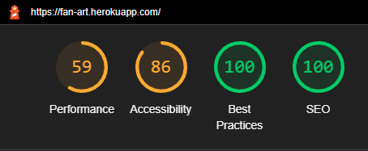  
Steps taken to improve the Lighthouse Scores, specifically performance:
* I compressed the images I had used on the site and reuploaded them
* I checked my assets folder and deleted any unnecessary files
* Ran Lighthouse in an incognito browser to ensure any extensions were not effecting the result
* I added a max height attribute to the post component

No problems in the Gitpod Workspace terminal  
  

### Bugs

I came across this issue after deploying the project. 
The urls '/profiles/...' or '/posts/...' would not properly handle the 404 error, when they were followed by any random strings.
 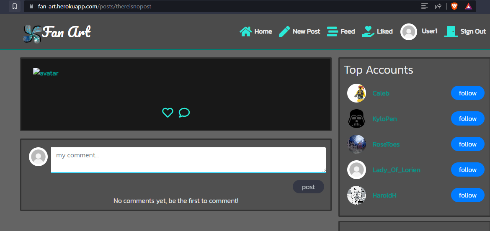

I managed to fix the issue by adding a small piece of code:  
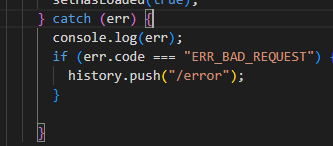  By changing the url to just'/error/' it renders the Page Not Found page. I thought this would work better than implementing a push to home, as that would likely confuse the user. If the user looks at the url they will see '/error/' and at the very least know something went wrong.  
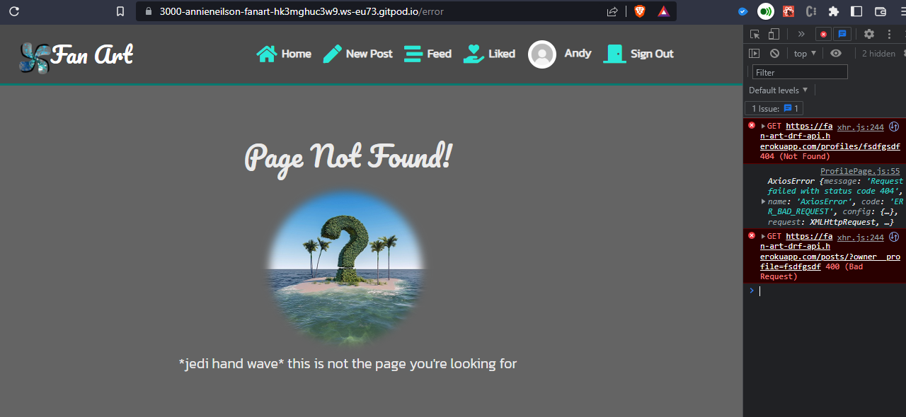  

## Deployment

This project was deployed through Heroku using the following steps:  

Before my final deployment to Heroku I added the following prebuild command in the package.json file:
* "heroku-prebuild": "npm install -g serve",
I then added a Procfile with the following web command:
* web: serve -s build

As my initial deployment was at the beginning at the project, final deployment was very easy:
* Log in to Heroku
* Navigate to the dashboard for Fan Art
* Select deploy tab, scroll to the bottom and click the deploy button.
* Once build is complete click the open app button.

The initial deployment was as follows:
* Create a new repository in in Github
* Open in Gitpod
* install the create-react-app package
* use the command npm start to check the app is working properly
* commit and push to gitHub
* Open Heroku and create new app
* Connect the app to the GitHub repository
* Deploy the branch

Deployment of API to Heroku:
* In settings.py add the heroku address for the API to ALLOWED_HOSTS
* Log in to heroku.com and select the application.
* In settings, reveal the config vars
* Add the new key of ALLOWED_HOST
* Back in settings.py, replace your ALLOWED HOSTS with the ALLOWED_HOST environment variable.
* In Heroku, settings, config vars, add CLIENT_ORIGIN_DEV with the gitpod preview URL for FanArt
* In settings create an ‘if’ statement to check if CLIENT_ORIGIN_DEV is defined
* Git add, commit, and push the changes to the settings.py file to GitHub
* Return to Heroku and deploy the API project

## Credits

### Code
* The project is based on the Moments project by Code Institute 
* I used this post on stackoverflow to toggle between icons for the accordion dropdown menu:
https://stackoverflow.com/questions/66664262/toggle-font-awesome-icon-when-clicked-in-react
    - OP, Nathan Sutherland

### Media
* Images - I used the following sites to gather images for the site:
 * Pexels.com
 * Pixabay.com
 * Unsplash.com

